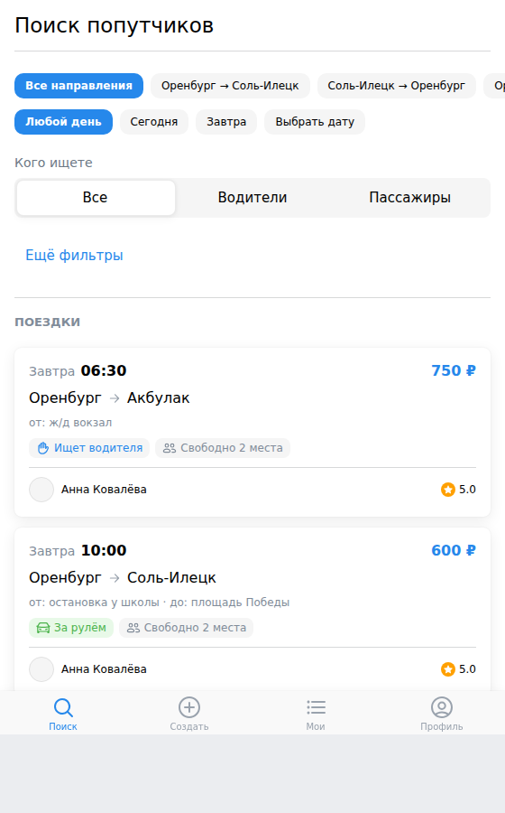
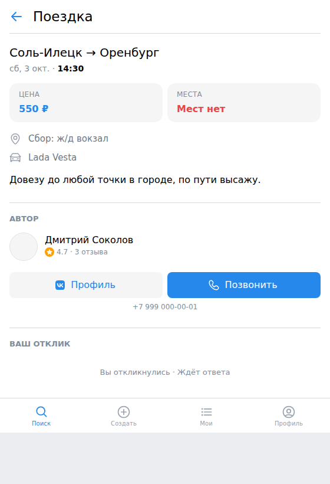
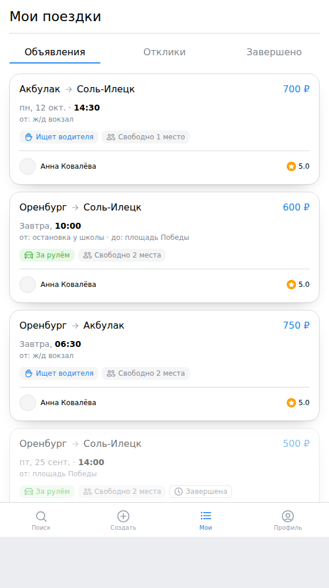
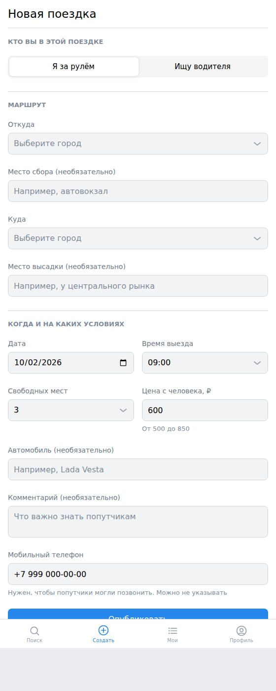
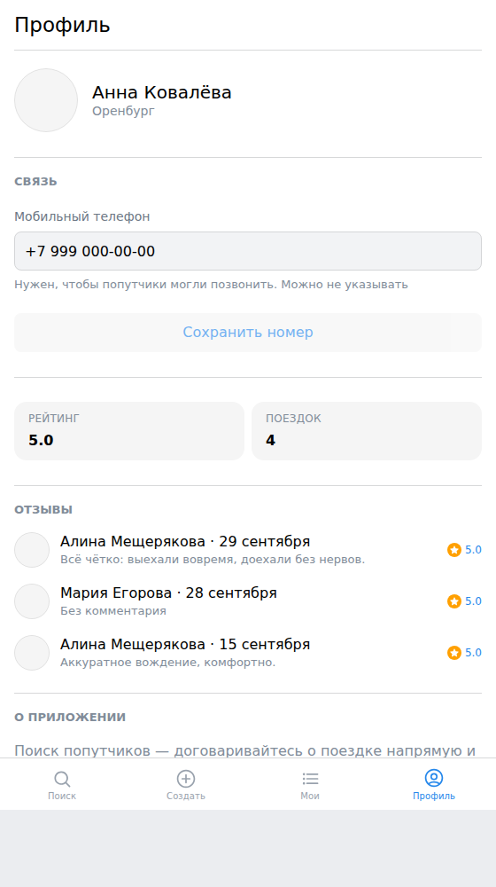
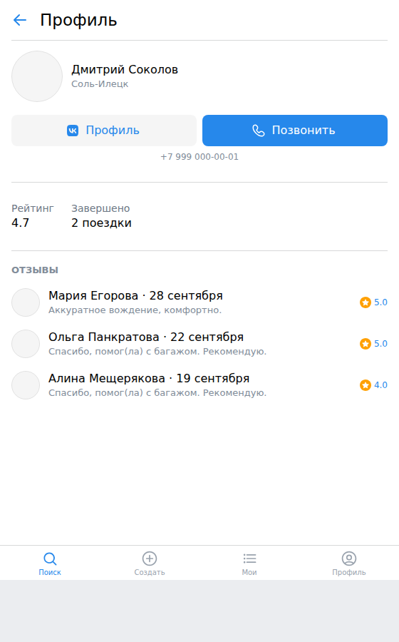
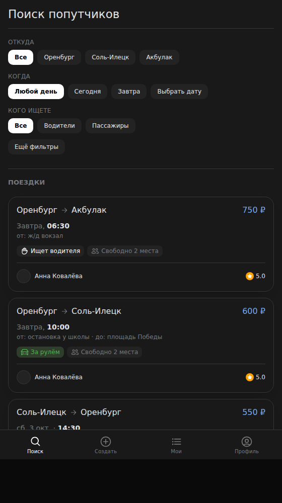
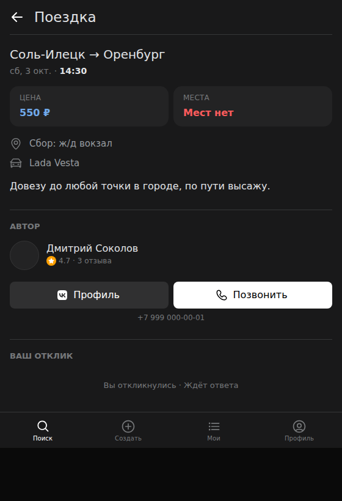
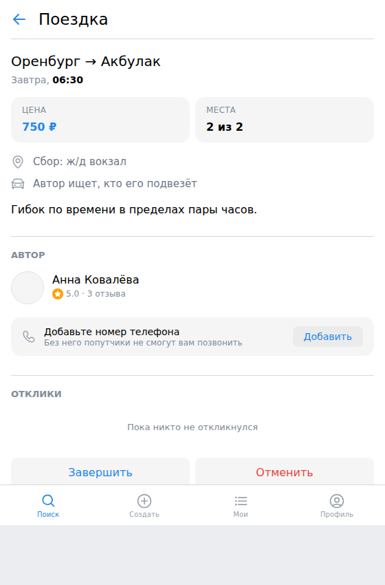

# Аватарка приложения


| Файл | Что это |
|---|---|
| `app-icon.svg` | исходник аватарки, векторный — правьте его, а не PNG |
| `app-icon-1024.png` | 1024×1024, для загрузки в кабинет разработчика |
| `app-icon-512.png` | 512×512, если понадобится размер поменьше |
| `app-icon-576.png` · `-278` · `-150` | размеры, которые требует кабинет разработчика |
| `app-icon-small.svg` · `app-icon-32.png` | упрощённый знак и фавикон: в 32 px пунктир маршрута рассыпается, поэтому для мелких размеров оставлена одна метка |
| `app-cover.svg` · `app-cover-1590x400.png` | широкая обложка |
| `app-snippet.svg` · `app-snippet-1120x630.png` | большой сниппет для ленты |
| `store/screen-*.png` | скриншоты 600×1200 для карточки |
| `app-icon-loader.json` · `scripts/build-lottie.py` | анимированная иконка загрузки (Lottie, 96×96) и её генератор |
| `app-icon-loader-frames.png` | раскадровка анимации — для проверки глазами |
| `store-copy.md` | тексты карточки и перечень требований кабинета |
| `privacy-policy.md` | черновик политики конфиденциальности |

## Что нарисовано и почему

Пунктирный маршрут от точки отправления к метке назначения.

- **Пунктир, а не сплошная линия.** В мелком размере сплошная линия
  слипается в одно пятно, а точки читаются как движение.
- **Маршрут доведён ровно до острия метки.** Метка рисуется поверх и
  перекрывает последнюю точку — знак читается как одно целое, а не как
  два отдельных объекта.
- **Фон без скруглённых углов.** Площадка сама обрезает аватарку под
  нужную форму: у скруглённого исходника на круглой маске вылезли бы
  углы фона.
- **Никакой типографики.** Буквы в аватарке нечитаемы в размере списка.

Знак проверен в размере 128×128 — маршрут и метка различимы.

## Обложка

Тот же знак и та же палитра, что у аватарки: обложка и иконка должны
читаться как одно приложение. Название вынесено в левую половину —
площадка может обрезать баннер по краям, и текст не должен попасть под
обрез.

## Анимированная иконка

`app-icon-loader.json` — Lottie 96×96, 9.4 КБ при лимите 24. Показывает
состояние загрузки мини-приложения: появляется точка отправления, за ней по
одной выкладываются точки маршрута, затем встаёт метка назначения — и всё
затухает перед новым кругом. Петля длится 1,67 секунды.

Собирается генератором, а не правится руками:

```
python3 scripts/build-lottie.py design/app-icon-loader.json
```

Почему генератором: Lottie — это JSON с десятками повторяющихся слоёв, и
ручная правка в нём означает ошибки. В скрипте заданы только исходные
величины, остальное считается. Геометрия берётся из тех же координат, что
и `app-icon.svg`, поделённых на 1024/96 — иначе при загрузке знак
«дёргался» бы при подмене анимации на статичную иконку.

Полуокружность в контуре метки (`A 92 92 0 1 1` в SVG) разложена на две
четверти кубическими кривыми с коэффициентом 0.5523 — Lottie дуг не знает.

Результат проверен настоящим плеером `lottie-web`, а не на глаз:
раскадровка в `app-icon-loader-frames.png`.

## Как пересобрать PNG

Правите SVG и запускаете из корня репозитория:

```
python3 scripts/render-icon.py design/app-icon.svg design/app-icon-1024.png 1024
python3 scripts/render-icon.py design/app-icon.svg design/app-icon-512.png 512
python3 scripts/render-icon.py design/app-cover.svg design/app-cover-1590x400.png 1590x400
```

Третий аргумент — либо сторона квадрата, либо `ШИРИНАxВЫСОТА`. Если
кабинет потребует другой размер обложки, пересоберите с ним.

Скрипт отрисовывает SVG headless-Chromium'ом и обрезает кадр до квадрата.
Отдельный конвертер понадобился потому, что ни `rsvg-convert`, ни
ImageMagick, ни Pillow в окружении сборки нет, а Chromium снимает кадр
размером с окно, которое на постоянную величину выше вьюпорта.

Путь к Chromium задан константой `CHROME` в начале скрипта — если у вас
он лежит в другом месте, поправьте её.

## Требования площадки

Точные требования к размеру и формату аватарки смотрите в кабинете
разработчика: проверить их из окружения сборки я не могу, поэтому
исходник векторный, а PNG пересобирается в любой нужный размер одной
командой.

---

# Экраны

Сняты headless-Chromium'ом на сид-данных, ширина 560.

| Поиск | Поездка | Мои поездки |
|---|---|---|
|  |  |  |

| Создание | Профиль | Связь |
|---|---|---|
|  |  |  |

Тёмная тема — не отдельная ветка в коде, а те же токены VKUI:

| Поиск | Поездка |
|---|---|
|  |  |

Автор на своей поездке видит на месте кнопок связи подсказку, если номер
в профиле не заполнен:



# Визуальная система

Отступы, радиусы, тени и вид «таблеток» заданы в одном файле —
`apps/web/src/styles/app.css`. Это не украшательство: пока значения
стояли inline по компонентам, «16 тут, 12 там» расползалось по экранам, и
приложение выглядело собранным наспех.

Решения, которые стоит сохранить при доработках:

- **Все отступы кратны 4** и берутся из `--app-space-*`. Новое значение
  добавляется в файл, а не пишется числом на месте.
- **Тень карточки мягкая и широкая**, без тёмного ободка. Плотная тень под
  каждым блоком — главный признак вёрстки на коленке. В тёмной теме она
  почти не видна, и структуру держит волосяная граница `--app-hairline`.
- **Цвета только из токенов VKUI.** Своя палитра сломала бы переключение
  темы вместе с клиентом ВКонтакте.
- **Цена — токеном `accent_blue`, а не `accent_themed`.** Второй в тёмной
  теме равен `#fff`, и цена там сливалась с остальным текстом.
- **Одни и те же приёмы на разных экранах.** Плитки факта (`.app-tile`)
  показывают цену и места на экране поездки и рейтинг с числом поездок в
  профиле. Повторяющийся приём читается как система, а не как набор форм.
- **Один язык выбора на весь проект.** Направление, день и роль в поиске,
  направление и число мест в форме создания — везде одинаковые
  «таблетки». Городов три, мест шесть: выпадающий список под такой
  замкнутый набор — лишний шаг (открыть, выбрать, закрыть вместо одного
  касания), да и оба города видны рядом, так что маршрут читается целиком.
  Выпадающий список остался там, где вариантов правда много: время выезда,
  48 получасовых слотов.
- **Роль в форме осталась сегмент-контролом.** Это не непоследовательность:
  «за рулём / ищу водителя» — выбор из двух взаимоисключающих вариантов, и
  сегмент-контрол показывает это лучше, чем два отдельных ярлыка.
- **Нижняя панель** оставлена штатным компонентом VKUI, переопределён
  только вид. Высота задаётся через `--vkui_internal--tabbar_height`:
  VKUI берёт из неё отступ содержимого, поэтому своя разметка панели
  потребовала бы повторять эту связь руками. Пересняты командой из корня репозитория при поднятом
`npm run dev`:

```
python3 - <<'PY'
import subprocess
for path, name in [("", "search"), ("#/create", "create"), ("#/my", "my")]:
    subprocess.run([
        "/opt/pw-browsers/chromium", "--headless", "--no-sandbox", "--disable-gpu",
        "--hide-scrollbars", "--virtual-time-budget=8000",
        f"--screenshot=design/screens/{name}.png", "--window-size=560,900",
        f"http://127.0.0.1:5173/{path}",
    ], capture_output=True)
PY
```
